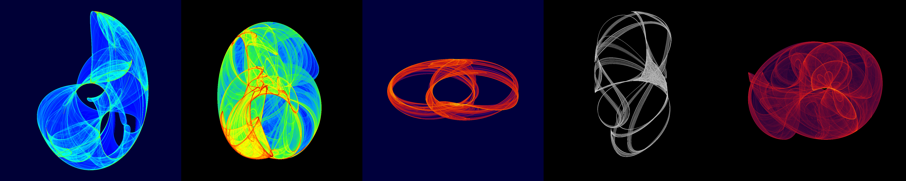

# Mandybrot

  

Render fractals and attractors with arbitrary precision arithmetic, allowing for high zoom levels.

## Attractors

Attractors are mathematical systems that exhibit chaotic behavior. They are defined by a set of equations that determine the next point in the system based on the current point. Attractors are rendered by plotting a heatmap of the points generated by the system. The following attractors are supported:

- Clifford
- De Jong
- Henon
- Ikeda
- Tinkerbell

## Fractals

Fractals are mathematical sets that exhibit self-similarity at all scales. They are rendered by repeatedly applying a complex function to a point and visualising how quickly the result diverges. The following fractals are supported:

- Mandelbrot
- Burning Ship
- Julia
- Tricorn
- MultiBrot
- Newton
- Phoenix
- Celtic Mandelbrot

  

> Sweeping through the parameter space of the Clifford attractor.
